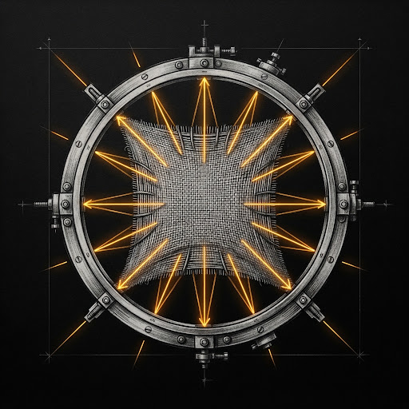
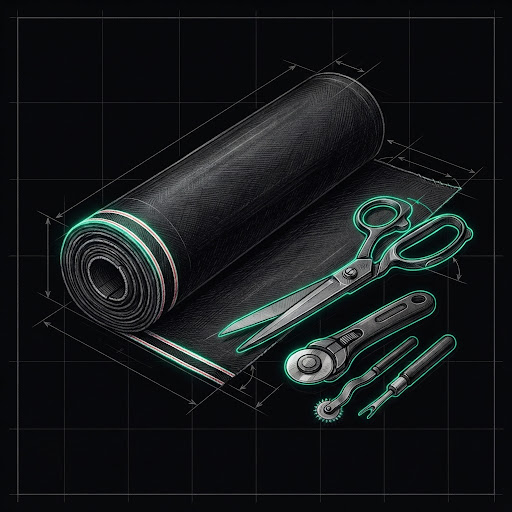
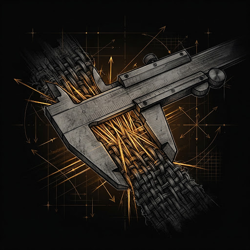

  

<h1 align="center">Fab7</h1>

<strong>Evidence for agentic software.</strong>

Ground decisions. Bound delegated work. Check evidence.

  <a href="https://getfab7.com"><strong>Visit homepage</strong></a>

Fab7 keeps agentic software grounded, reviewed, and checkable through three distinct evidence boundaries.

| RingFrame | Denim | Cuff |
|:---:|:---:|:---:|
|  |  |  |
| **Ground decisions.** Turn business questions into explicit knowledge, scenarios, and evaluation criteria. | **Bound delegated work.** Separate execution from review and keep closure under owner control. | **Check evidence.** Record exact verifier results against Git state and fail closed when evidence becomes stale. |
| [View RingFrame](https://github.com/fab7hq/ringframe) | [View Denim](https://github.com/fab7hq/denim) | [View Cuff](https://github.com/fab7hq/cuff) |

The chain is deliberate: RingFrame grounds what should be evaluated, Denim bounds who executes and reviews, and Cuff records what was actually checked.
